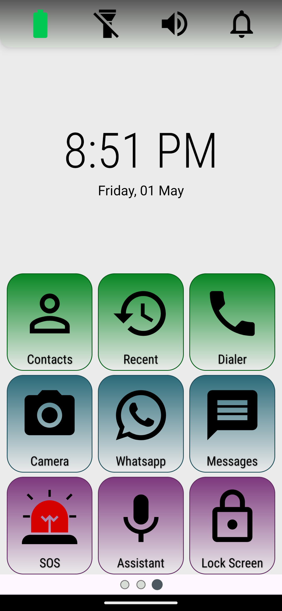
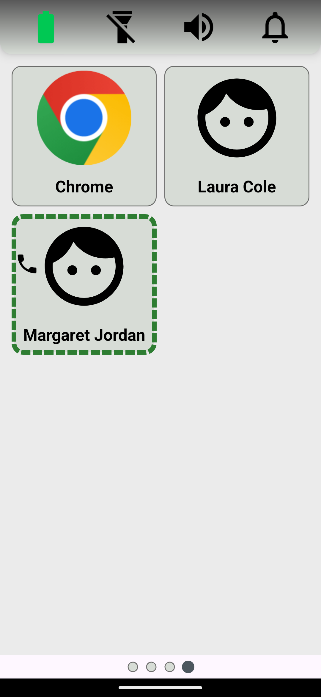
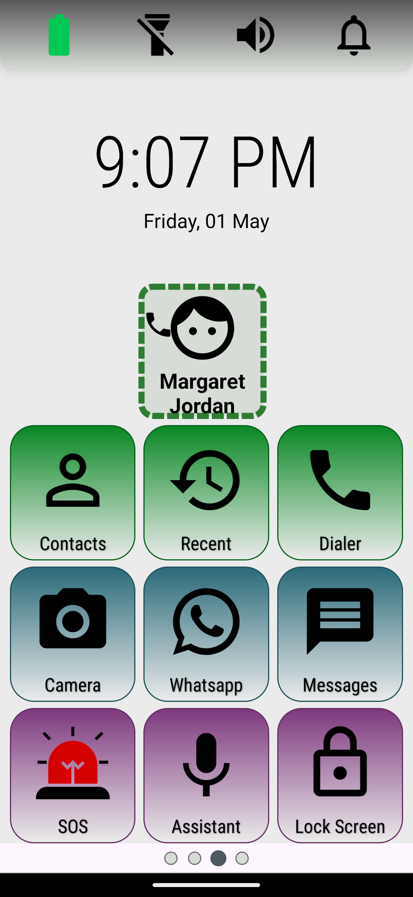
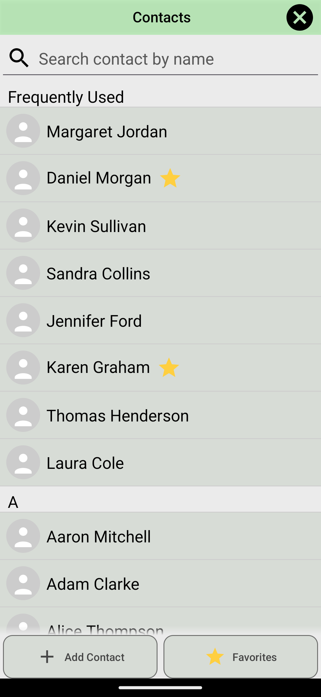
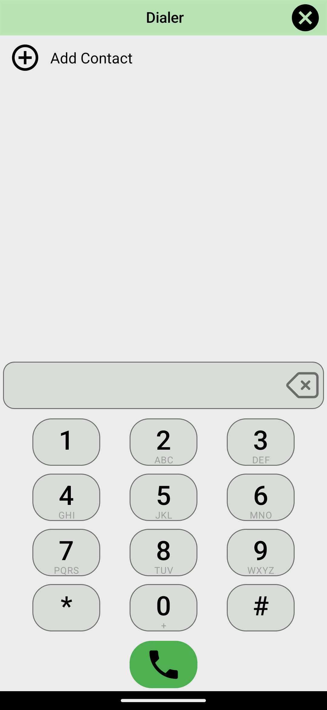
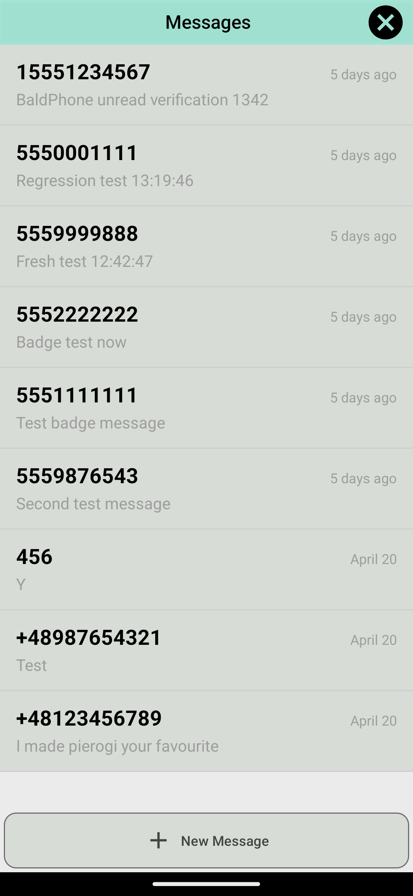
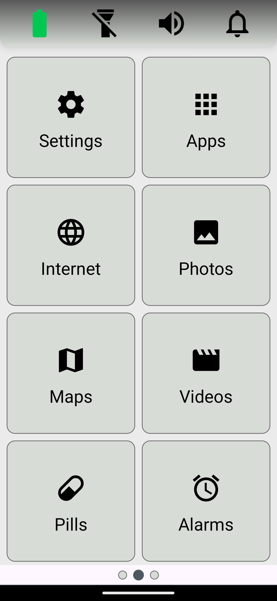
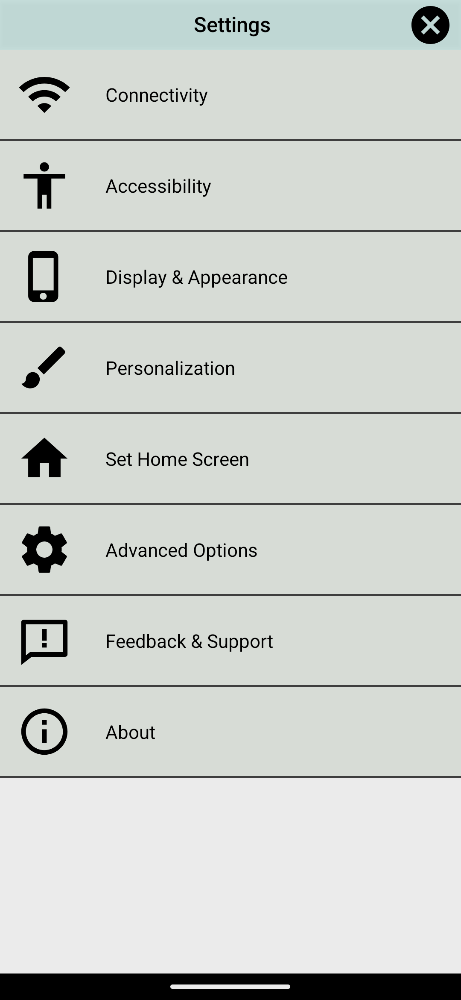

# Simple User Manual

This document is a user-readable behavioral specification for the main BaldPhoneMini features. It describes what users can do, what behavior is visible, and what safe fallback behavior functional tests verify.

## Home Screen

The home screen is the main launcher screen. It uses large buttons and simple labels for common phone actions. The top area shows the current time and date. The main button area contains phone and launcher actions such as Contacts, Recent calls, Dialer, Camera, WhatsApp, Messages, SOS, Assistant, and Lock Screen. On older Android versions where device locking is unavailable, the Lock Screen slot opens Apps instead.

Some home buttons can be replaced with custom installed apps through the home screen editor. When a native BaldPhone button is replaced, tapping that button launches the chosen app instead of the built-in screen. Restoring the native button brings back the built-in behavior.

Buttons can also be hidden. In that case they do not show up on the home screen. This simplified view helps avoid confusing elderly users.

The home screen can also show speed dial entries. A speed dial entry is a large contact tile for quickly calling a saved number. Tapping a speed dial tile opens a confirmation dialog; confirming places the call and canceling leaves the user on the home screen. Speed dial entries are added from a contact details screen. If the contact has more than one number, the user chooses which number is used. Regular pinned contact tiles open contact details; speed dial tiles confirm and then call the saved number. Speed dial entries always appear in the order they were added; removing one entry does not shift the positions of the remaining ones.

Pinned contacts, pinned apps, and speed dial entries appear on one or more additional home pages to the right of the main home screen, up to eight items per page. The first three speed dial entries also appear in a dedicated row on the main home screen.

Users can move between pages by swiping. If basic accessibility page arrows are enabled, large page arrows are also shown for users who find swiping difficult.

## Top Bar Controls

The top bar gives quick access to device status and common controls. In full mode it shows Battery, Flashlight, Sound, and Notifications. In simplified mode it shows only Battery and Notifications.

Battery shows the current battery state. Tapping it shows a short battery status message that disappears automatically.

Flashlight switches the device flashlight on and off. The icon changes to show whether the flashlight is currently enabled. If camera or flashlight access is unavailable, the control fails safely without crashing.

Sound changes the phone sound mode. The user can switch between normal sound, vibration, and mute/silent behavior.

Notifications indicates whether active notifications exist. The bell icon changes with the notification state: it shows the no-notifications icon for no or very few notifications, the some-notifications icon for a moderate number of notifications, and the many-notifications icon when there are many notifications. In the many-notifications state, the icon becomes more urgent and may animate. If the notification count cannot be read, an error icon is shown. Tapping the bell opens the notifications screen. The notifications screen lists active notifications, lets the user open a notification when possible, and lets the user clear a single notification or clear all notifications.

## Contacts

Contacts opens the user's contact list after contact permission is available. The screen supports browsing contacts, searching contacts, opening contact details, and adding a new contact.

When call log permission is available, the Contacts screen can show a Frequently Used section near the top. This section surfaces contacts that appear most often in recent call history. If call log permission is missing, the contacts list still works without the frequent contacts section.

Contact details show the selected contact's information and available actions. From contact details, the user can call a number, add or remove the contact from the home screen, add or remove a speed dial entry, and use other contact actions supported by the device. Contact actions handle missing numbers, missing permissions, deleted contacts, and unavailable external apps without crashing.

## Dialer And Calls

Dialer opens a large keypad for entering a phone number. The user can type digits, delete digits, call the entered number, or add the entered number as a new contact.

Calling goes through the app's call handling flow. If direct call permission is available, the app can place the call directly. If permission is missing, the app falls back to opening the system dialer. Emergency numbers, dual-SIM choices, and missing phone apps use the same safe call behavior.

Recent calls opens a simple recent call list when call log permission is available. The user can review recent calls and start a call or contact action from the list. If permission is missing, the app requests it or shows a safe fallback.

## Messages

Messages opens the built-in simplified SMS experience when the native Messages home button is active. The inbox shows SMS conversations in a large, readable list. Unread messages are reflected by the unread message indicator on the home screen.

Opening a conversation shows the message history for that contact or phone number. The user can read incoming messages and send a new SMS reply. Incoming SMS messages appear in the correct conversation and update unread state.

When BaldPhoneMini is the default SMS app, it can receive incoming SMS messages, write incoming SMS to the system provider, mark messages as read, and maintain unread badges. If the Messages home button is replaced with a custom app, BaldPhoneMini gives up the default SMS role. When the native Messages button is restored, the app asks to become the default SMS app again on supported Android versions.

## Second Home Screen

The second home screen (to the left from the Home Screen) contains less frequent launcher features. Supported optional buttons, such as Internet, Maps, Photos, Pills, and Alarms, can be hidden from settings so the screen can be simplified.

Applications opens the installed applications list. The user can launch an app. In selection flows, the same app list is used to choose a replacement app for a home-screen button.

Internet opens a browser app. If more than one browser app is available, BaldPhoneMini shows a simple in-app picker. If no browser app is available, it shows an error message instead of crashing.

Photos opens BaldPhoneMini's simplified photo browser for device images. The user can browse image thumbnails in a large grid, open a single image in the simplified viewer, share it, or delete it when the device allows deletion.

Videos opens BaldPhoneMini's simplified video browser for device videos. The user can browse video thumbnails in a large grid, open a video in the simplified player, play or pause it, share it, or delete it when the device allows deletion.

Maps opens a maps app. If more than one maps app is available, BaldPhoneMini shows a simple in-app picker. If no maps app is available, it shows an error message instead of crashing.

Pills opens pill reminders. The user can view reminders, add a reminder, edit a reminder, delete a reminder, and configure reminder times. Reminders use six shared daily time slots: Morning, Afternoon, Evening, Extra 1, Extra 2, and Extra 3. Each slot has a configurable clock time. Changing a slot time updates all reminders assigned to that slot. When a pill alarm rings, it shows the reminder clearly and stops according to the app's alarm behavior.

Alarms opens the alarm management screen. The user can view alarms, add an alarm, edit an alarm, delete an alarm, and respond when an alarm rings.

Settings opens the main settings screen.

## Applications And Home Customization

The Applications screen lists installed apps using the configured sort mode. Depending on settings, apps may be displayed in one grid or a grouped layout, and colorful app styling may be enabled or disabled. Tapping an app launches it.

The home screen editor lets the user choose what the main launcher buttons do. The user can keep the native BaldPhone action, replace it with an installed app, or hide supported optional buttons. The customization is visible when returning to the home screen.

The user can add installed app shortcuts, regular contact shortcuts, and speed dial shortcuts. Adding enough shortcuts creates additional home pages. Removing or changing shortcuts updates the home pages without requiring an app restart.

## Settings

Settings groups device and launcher options into large, simple categories.

Connectivity opens Android shortcuts for Wi-Fi, Bluetooth, airplane mode, NFC when available, and location. These are system settings screens, so exact content depends on the device and Android version.

Accessibility contains options that make the launcher easier to use. The user can choose the keyboard, change accessibility level, enable page arrows in basic mode, configure accidental touch protection, choose dominant hand behavior, and adjust font size.

Display and Appearance contains visual and audio presentation settings such as theme, brightness, font size, and alarm volume.

Personalization controls home-screen content and app behavior. It includes language settings, pill time setup, home-screen editing, status bar visibility, full or simplified top bar controls, optional second-screen buttons, dialer sounds, dual-SIM behavior, app sort method, colorful app styling, low battery alerts, font size, and alarm volume.

Set Home Screen helps set BaldPhoneMini as the default launcher. The app guides the user into the Android default home app flow. If the user later wants to return to the previous launcher, the app provides a safe path back through Android's launcher selection behavior.

Advanced Options opens the standard Android system settings for advanced device configuration.

Feedback and Support opens a feedback form that sends support information by email. If no email app is available, the app shows a safe fallback.

About shows app information such as version, credits, license, and project links.

## Permissions And Resilience

Many features depend on Android permissions or default-app roles. Contacts need contact permission, calls need phone permission for direct calling, recent calls need call log permission, photos and videos need media access depending on Android version, flashlight needs camera or flashlight access, notifications need notification access, and SMS features depend on the default SMS role.

When a permission is missing, the app requests it when appropriate or continues with a reduced feature set. A skipped side effect is acceptable; an app crash is not. Functional tests cover both granted and denied permission states for important flows.
