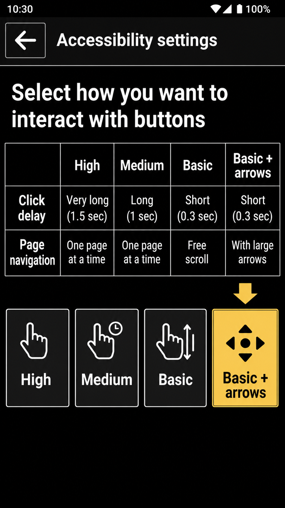

# Basic Accessibility Page Arrows Design

## Goal

Add an option that lets users show page navigation arrows while using the basic
accessibility level.

Basic accessibility currently favors direct touch and swipe gestures. Some users
can tap normally but still benefit from large explicit previous/next controls, so
arrow visibility should become configurable without changing the selected
accessibility level.

## Current Behavior

The accessibility level selector stores several interaction choices through
legacy shared preferences.

For the regular/basic level, `TutorialFragment2` sets:

| Preference | Value | Effect |
|---|---:|---|
| `LONG_PRESSES_KEY` | `false` | Buttons respond to normal taps |
| `LONG_PRESSES_SHORTER_KEY` | `false` | Medium/long click delay is disabled |
| `TOUCH_NOT_HARD_KEY` | `true` | Touch scrolling/swiping is enabled |

`ViewPagerHolder` currently interprets `TOUCH_NOT_HARD_KEY` as "no arrows":

- `true` creates a normal swipeable `ViewPager`
- `false` creates a `NonSwipeableViewPager`
- arrows are only inflated when `TOUCH_NOT_HARD_KEY` is `false`

This couples two separate concepts:

- whether the user can swipe pages
- whether explicit left/right arrow buttons should be visible

## New Behavior

Keep the existing accessibility levels unchanged, but add a separate setting for
showing arrows in basic accessibility mode.

Expected combinations:

| Accessibility behavior | Swipe enabled | Arrows visible |
|---|---:|---:|
| High level | No | Yes |
| Medium level | No | Yes |
| Basic level, default | Yes | No |
| Basic level, new option enabled | Yes | Yes |

The default remains unchanged so existing users keep the current basic-level
experience after upgrading.

## Preference Model

Add a new boolean preference in `BPrefs`:

| Preference | Default | Meaning |
|---|---:|---|
| `BASIC_ACCESSIBILITY_PAGE_ARROWS_KEY` | `false` | Show page arrows even when touch/swipe navigation is enabled |

`TOUCH_NOT_HARD_KEY` should continue to mean "touch/swipe navigation is enabled".
It should no longer be used directly as an arrow visibility flag.

## ViewPagerHolder Plan

Replace the current `noArrows` decision with two booleans:

```
touchNavigationEnabled = sharedPreferences.getBoolean(TOUCH_NOT_HARD_KEY, false)
showArrows = !touchNavigationEnabled ||
        sharedPreferences.getBoolean(BASIC_ACCESSIBILITY_PAGE_ARROWS_KEY, false)
```

Then:

- create `ViewPager` when `touchNavigationEnabled` is `true`
- create `NonSwipeableViewPager` when `touchNavigationEnabled` is `false`
- inflate `view_pager_holder_arrows` when `showArrows` is `true`
- update arrow visibility on page changes only when arrows exist

This keeps swipe behavior and arrow behavior independent.

## Settings UI

Add an Accessibility settings item, near "Accessibility level", with an On/Off
dialog.

Suggested label:

- "Page arrows in basic mode"

Suggested description:

- "Show previous and next arrows even when swipe navigation is enabled."

The setting should be phrased as an advanced accessibility preference, not as a
new fourth accessibility level. This avoids changing the existing level selector
and keeps the current high/medium/basic model intact.

## Accessibility Level Screen

The existing table says basic-level scrolling is "Swipe". That remains true, but
it becomes incomplete when the new setting is enabled.

Options:

1. Leave the table unchanged and document the arrow setting separately.
2. Change the basic-level scrolling cell to a neutral string such as
   "Swipe, optional arrows".

Option 2 is clearer, but it requires one new translatable string and updates to
localized resources over time.

## Strings

Minimum new strings in `values/strings.xml`:

| Name | English text |
|---|---|
| `page_arrows_basic_mode` | `Page arrows in basic mode` |
| `page_arrows_basic_mode_subtext` | `Show previous and next arrows even when swipe navigation is enabled.` |

Optional string if the accessibility table is updated:

| Name | English text |
|---|---|
| `swipe_optional_arrows` | `Swipe, optional arrows` |

## Testing Plan

Manual checks:

1. Select high accessibility level and confirm paged screens still show arrows
   and do not allow swipe navigation.
2. Select medium accessibility level and confirm paged screens still show arrows
   and do not allow swipe navigation.
3. Select basic accessibility level with the new setting off and confirm paged
   screens allow swipe navigation and hide arrows.
4. Select basic accessibility level with the new setting on and confirm paged
   screens allow both swipe navigation and arrow navigation.
5. Confirm first page hides the left arrow and last page hides the right arrow.
6. Confirm screens using circle indicators still work with the new arrows.

Automated coverage can be limited unless a test fixture already exists for
`ViewPagerHolder`. The main risk is UI wiring, so screenshot or instrumentation
coverage on one paged screen would be more useful than a unit test.

## UX Mockup

This mockup is a rough visual candidate for the four-level selector:



It is useful as a design reference, not as a committed layout. The fourth option
fits, but the table and button row are noticeably tighter than the current
three-option screen, which is the main crowding concern to keep in mind.

## Implementation Scope

Files expected to change when implementing:

| File | Planned change |
|---|---|
| `app/src/main/java/com/bald/uriah/baldphone/utils/BPrefs.java` | Add new preference key and default |
| `app/src/main/java/com/bald/uriah/baldphone/views/ViewPagerHolder.java` | Split swipe behavior from arrow visibility |
| `app/src/main/java/com/bald/uriah/baldphone/activities/SettingsActivity.java` | Add On/Off setting |
| `app/src/main/res/values/strings.xml` | Add setting strings |
| `app/src/main/res/layout/tutorial_fragment_2.xml` | Optional table text update |

No database migration is needed.
